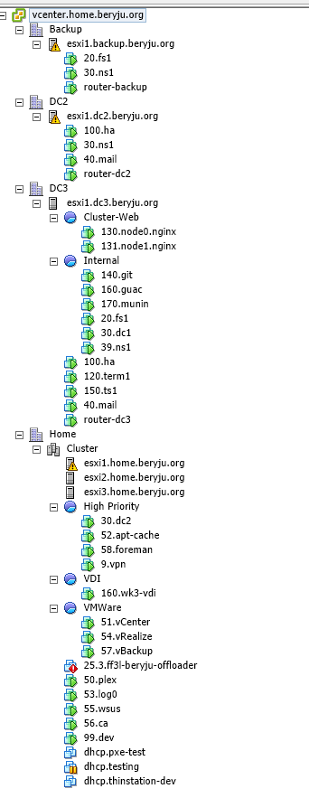

===

## Home Setup Walkthrough

A few people on /r/homelab asked for this and I've been wanting to do it for some time anyways, so here it goes

## Let's jump right in!

#### The Screens are 3x Dell G210 24", one Hyundai 17" Screen and a Medion 23" Screen.

#### Code Keyboard with Tai-Hao PBT Doubleshot Keys

#### Logitech G500. Great Mouse.

#### Blue Snowball. The Red LED is disconnected since it's pretty annoying. Next to that, a FiiO E10 Olympus for Output

## The 'Rack'

#### Let's start from the Top. Random Stuff and Audiotechnica ATH-M50's. Good Headphones, just a bit lacking in the bass department

#### Self-built PC

Specs:
 - Intel Core i7 2700k
 - AsRock P67 Pro3 SE (awful Motherboard, but I got it for cheap)
 - 8 GB DDR3 Mixed RAM (some Corsair and some Kingston)
 - Sapphire Radeon R9 280x with 1 Broken Fan
 - OEM Radeon HD 7550 for more Screens
 - Samsung 830 128 GB SSD
 - Xigmatek Case...I forgot the exact Name
 - Windows 10 Pro x64

#### 2x HP ProLiant DL380G6

Specs:
 - Intel Xeon E5540
 - 12 GB DDR3 ECC RAM
 - 2x 146 GB 15K SAS Drives each
 - ESXi 6.0u2

#### Whitebox Server

Specs:
 - Intel Xeon E5405
 - 24 GB DDR2 ECC RAM
 - Supermicro X7DB-E
 - No Harddrives
 - ESXi 6.0u2

#### Switches - 2x Netgear GS748TS, Stacked

#### Whitebox NAS/SAN

Specs:
 - Intel Core i3 2100
 - 8 GB DDR3 ECC RAM
 - Asus P8P67-M
 - 3ware 9650-8LPML
 - 2x 160 GB HDD for OS (Debian 8 with ZFSOnLinux)
 - 2x 250 GB SSD for VMs (shared via iSCSI)
 - 3x 2 TB HDD for Data (RaidZ1)
 - 5x 1 TB HDD for Backups (Raid Z1)

#### Overview of the vCenter

#### Using a bunch of Power

## DJ Setup

#### Laptop is a Dell Vostro 3550

### Cat Tax!


